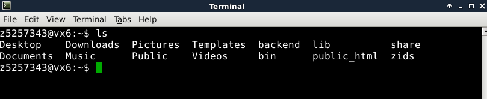
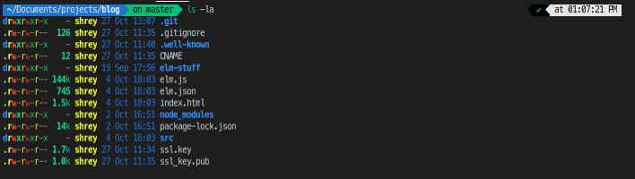
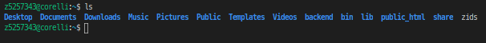
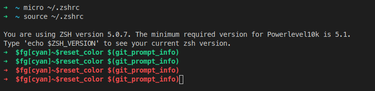
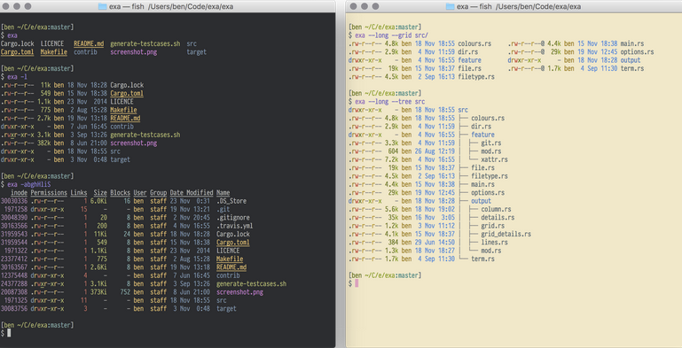

# How to make an aesthetic cse terminal

From



to



## Assumptions

- you've watched [Tom Kunc's Secrets of CSE workshop]()
- you haven't messed with the cse terminal before, and your login shell is still bash (ie you havent emailed SS to change it)

## Some basic colours :)

So, you want some colours eh?

Simply run the command

```
1511 colours
```

should setup your bash terminal to now be colourful! Make sure to refresh your terminal configuration with

```
source ~/.bashrc
```

in order to see it take effect.



## Powerlevel10k

### What is powerlevel10k?

Powerlevel10k is one of the most popular plugin frameworks for Zsh. It comes with many features and extensions, and allows you to customise nearly everything to your liking. It brags an "out of box" experience, meaning that theres not much setup we have to do get it working :D


### What is zsh?

You may be thinking, hold up - what is zsh?

let's take a step back - a terminal is a program that runs a shell - so when you open your terminal in Vlab or elsewhere, a shell is automatically opened, and executed. On CSE Servers, the default login shell is `bash`.

ZSH (aka the Z Shell) - is nothing more than a different shell. So why do we care if we use `bash` vs `zsh` as our shell? What's the difference?

### bash vs zsh

The difference mainly between zsh and bash is that zsh comes with an extended set of features, and many well supported plugin and theme managers, such as powerlevel10k - which we mentioned above. Some of the useful features include:

- command history shared across all running shells, rather than just the current running shell
- better tab completion (zsh cycles through all options, rather than listing them all)
- spelling correction and autofill
- Directory aliases (such as `~` or `..` - you can make your own)
- git command completion and aliases
- path expansionn e.g. Enter cd /u/lo/b, press tab, and it will be completed to cd /usr/local/bin since it is the only matching pattern

Most importantly to us - it allows us to make our terminal LOOK PRETTY

## Installing zsh on CSE

We dont need to do this, its already installed for us :)

## Installing Powerlevel10k

### Installing ohmyzsh

ohmyzsh is a plugin manager for managing zsh configurations. We'll use this to install powerlevel10k soon.

The default location is `~/.oh-my-zsh` (hidden in your home directory, you can access it with `cd ~/.oh-my-zsh`)

To install ohmyzsh - follow the instructions [here](https://github.com/ohmyzsh/ohmyzsh#getting-started), or trust that I'm not trying to hack your computer, and run the following:

```
sh -c "$(wget -O- https://raw.githubusercontent.com/ohmyzsh/ohmyzsh/master/tools/install.sh)"
```

This will install and setup a default zsh theme, and put some sane presets in `~/.zshrc`

### Installing powerlevel10k

Now that we've got ohmyzsh, we want to install the powerlevel10k theme.

Take a look at the instructions [here](https://gist.insou.dev/gitstatus), or trust me again (???) and run

```
git clone --depth=1 https://gitee.com/romkatv/powerlevel10k.git ${ZSH_CUSTOM:-$HOME/.oh-my-zsh/custom}/themes/powerlevel10k
```

and then finally, we set the theme (should be on line 11) in our `~/.zshrc`:

```
ZSH_THEME="powerlevel10k/powerlevel10k"
```

after you save this, we need to once again make sure to refresh your terminal configuration with

```
source ~/.zshrc
```

in order to see it take effect.

### Ruh Roh - shits broke

OH NO everything is broken :(

If you're looking at something like this (without the first line)



then don't worry - I knew that would break, so lets talk about how to fix it.

You may be wondering "thats strange, I guess we don't have the right version of zsh because powerlevel10k is using a really new version of zsh! The prompt says 5.1, it must be super new for CSE to not support it!"

Well I hate to break it to you folks but ZSH 5.1. was realeased **five years ago** (31.5.2015)

It seems that we're still on a zsh version (5.0.7) from 2014 :(

No fear though! We can fix this :D

## Installing zsh on CSE (round 2)

So, you want the latest version of zsh eh?

We're gonna have to use our broken terminal for now - but it should be nothing more than copying and pasting commands. Enter the following commands one at a time. You'll know when the command is done when you see the little '->' arrow on the bottom left

```
cd ~
wget -O zsh-5-8.tar.xz https://sourceforge.net/projects/zsh/files/zsh/5.8/zsh-5.8.tar.xz/download
tar xf zsh-5-8.tar.xz
cd zsh-5.8
./configure --prefix="$HOME/bin"
make && make install
cd ~
rm -rf zsh-5-8.tar.xz zsh-5-8
```

If succesful, you should see three folders once you navigate to `~/bin` which are (`bin`, `share`, and `lib`).

Then, to make sure that we run OUR version of zsh every time, we add the folllowing to the TOP (!!) of `~/.bashrc`

```
export PATH="$HOME/bin/bin:$PATH";
export SHELL="$HOME/bin/bin/zsh";
export MODULE_PATH="$Home/bin/lib/zsh/5.8/zsh";
exec "$SHELL" -l;
```

Finally, run

```
source ~/.bashrc
```

and you'll be met with the Powerlevel10k configuration wizard (YAY!)

Go through and answer the questions, formatting your terminal to your liking.

Congratulations you now have a pretty terminal!

### Assorted CSE x Powerlevel10k Issues

You have a pretty terminal, but you may start to notice a few issues

#### fetching gitstatusd

Every time you login (/open) a cse terminal - you might see "fetching gitstatusd..." for a few seconds.
While this probably wouldnt annoy the average person - it absolutely infuriates me (and a few others)/

[@insou22](https://github.com/insou22) has kindly provided a script to fix this issue, which you can run using

```
curl https://gist.insou.dev/gitstatus | sh
```

followed by

```
source ~/.bashrc
```

This will download `gitstatusd` and ensure that every time we open zsh - the computer knows where to find it, wheras whats happenning currently is that the cache is wiped every time you log off which is #notgood

## Further extensions + customisation

### Plugins!

#### zsh-syntax-highlighting

Clone the syntax highlighter

```
git clone https://github.com/zsh-users/zsh-syntax-highlighting.git ${ZSH_CUSTOM:-~/.oh-my-zsh/custom}/plugins/zsh-syntax-highlighting
```

Activate it by adding it to the `plugins` array inside `~/.zshrc`, and then sourcing `zshrc`

ie making sure that the plugins line is:

```
plugins=(git zsh-syntax-highlighting)
```

and then running

```
source ~/.zshrc
```

#### zsh-autosuggestions

Suggesting commands as you type based on history and completions!!
As you type commands, you will see a completion offered after the cursor in a muted gray color.
If you press the<kvd> → </kbd> key (forward-char widget) or <kbd>End</kbd> (end-of-line widget) with the cursor at the end of the buffer, it will accept the suggestion, replacing the contents of the command line buffer with the suggestion.

Clone the plugin

```
git clone https://github.com/zsh-users/zsh-autosuggestions ${ZSH_CUSTOM:-~/.oh-my-zsh/custom}/plugins/zsh-autosuggestions
```

Activate it by adding it to the `plugins` array inside `~/.zshrc`, and then sourcing `zshrc`

ie making sure that the plugins line is:

```
plugins=(git zsh-syntax-highlighting zsh-autosuggestions)

```

and then running

```
source ~/.zshrc
```

#### zsh-z

ZSH-z is a command line tool that allows you to jump quickly to directories that you have visited frequently in the past, or recently -- but most often a combination of the two (a concept known as "frecency"). It works by keeping track of when you go to directories and how much time you spend in them.

Same as the other plugins, we clone

```
git clone https://github.com/agkozak/zsh-z $ZSH_CUSTOM/plugins/zsh-z
```

add

```
plugins=(git zsh-syntax-highlighting zsh-autosuggestions zsh-z)
```

and source

```
source ~/.zshrc
```

### exa

Exa is a "modern replacement for _ls_


simply run

```
cargo install exa
mv ~/.cargo/bin/exa ~/bin
```

you can remove cargo if you are running out of space, since we have kept exa in our own bin.

I like to use the alias

```
alias ll="exa -l"
```

in my `~/zshrc'

# Conclusion

You now have a pretty terminal, and theres so much more you can do!

Checkout the following extra resources

# Extras + Notes

### Further Customisation:

https://github.com/romkatv/powerlevel10k/blob/master/README.md#configuration
https://github.com/romkatv/powerlevel10k/blob/master/README.md#how-do-i-change-prompt-colors

### Fonts are showing weird symbols

Install the correct font into your terminal - I'm still yet to get this working on VLAB.

Works on CSE through ssh, since obviously the font being used is on your local machine.

Take a look at https://github.com/romkatv/powerlevel10k#fonts
